# Atividade 1.1 Avaliativa - 1º Bimestre
# Nome: ANDRE LUIZ ARNAUD DOS SANTOS

## Introdução
Este relatório descreve o desenvolvimento da Atividade 1.1 da disciplina de Sistemas Operacionais. O objetivo central da prática foi configurar um ambiente de desenvolvimento web isolado utilizando a tecnologia de conteinerização do Docker, com o framework Django rodando sobre uma base Linux (Fedora). A atividade exigiu a criação de um `Dockerfile`, a montagem de volumes para sincronizar os arquivos entre o sistema hospedeiro (utilizei o ambiente do GitHub Codespaces) e o contêiner, além do mapeamento de portas de rede para permitir o acesso externo à aplicação em execução.

## Relato das atividades

Iniciei a prática realizando o fork e o clone do repositório para o meu GitHub Codespaces. Na raiz do projeto, acessei a pasta, criei o diretório `app` e o arquivo `requirements.txt` com a dependência `Django==4.2.7`.

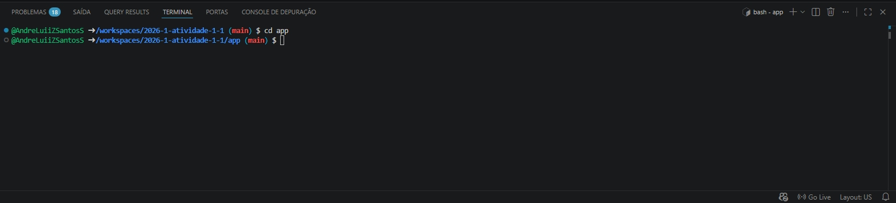
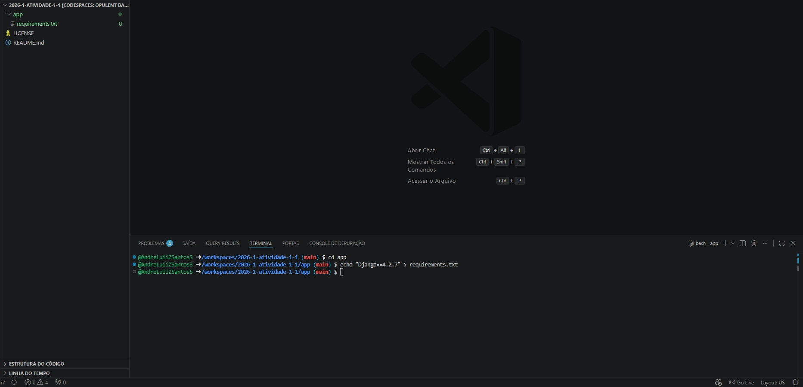
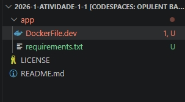

Em seguida, redigi o arquivo `Dockerfile.dev`, instruindo o Docker a baixar a imagem do Fedora, instalar as dependências de sistema (como Python3 e sqlite) e instalar o Django. 

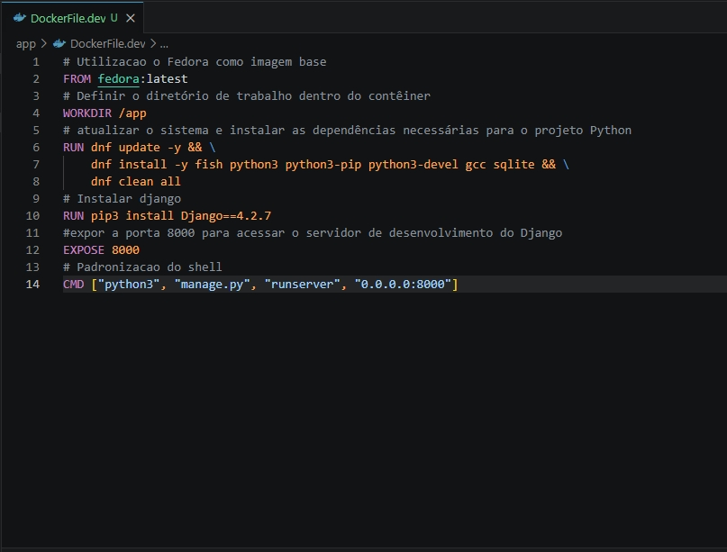

Com o arquivo pronto, executei a construção da imagem com o comando `docker build` e subi o contêiner de forma interativa com o comando `docker run`, mapeando a porta 8000 e criando um volume da minha pasta atual para o diretório `/app` do contêiner.

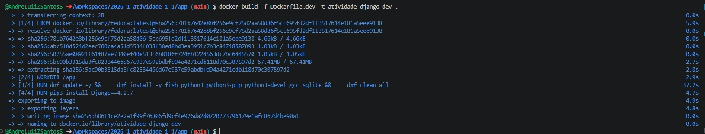
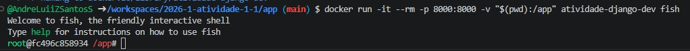

Já dentro do terminal do contêiner (utilizando o shell `fish`), iniciei o projeto Django (`myproject`) e a aplicação (`webapp`). 

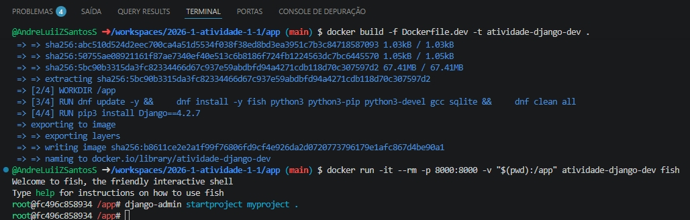
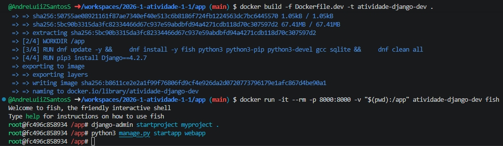
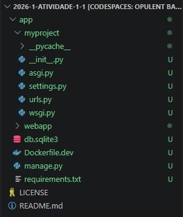

Ajustei o arquivo `settings.py` para incluir a aplicação, configurar o banco SQLite3 padrão e ajustar a variável `ALLOWED_HOSTS = ['*']` para permitir o acesso pelo Codespaces. Durante a edição dos arquivos para criar a página inicial exigida na atividade, me deparei com um erro de permissão (EACCES) no VS Code. Como os arquivos foram gerados pelo usuário `root` dentro do contêiner, o editor externo não tinha permissão de escrita. Resolvi isso executando `chmod -R 777 /app` no terminal do contêiner. Após corrigir a permissão, realizei as migrações do banco.

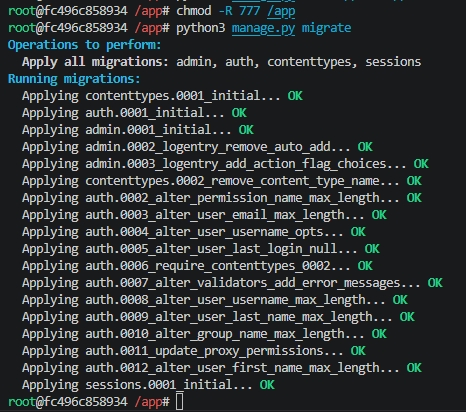

Com o banco configurado, criei o superusuário administrador.

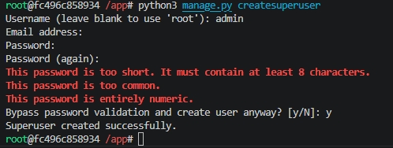

Em seguida, configurei a view simples e as rotas da aplicação e do projeto.

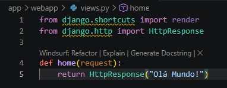
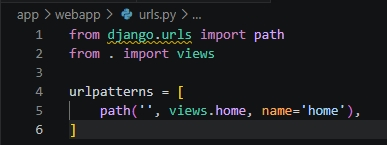
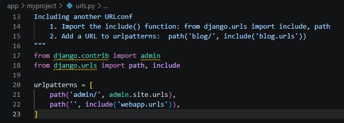

Por fim, iniciei o servidor de desenvolvimento. 

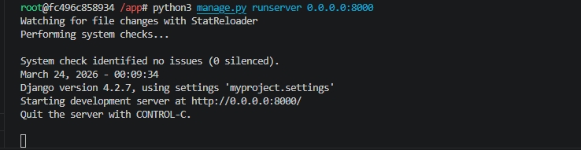

Acessei a aplicação pelo navegador, visualizando com sucesso a página inicial e a tela de administração do Django. 

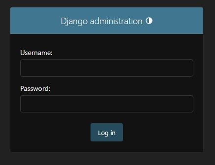
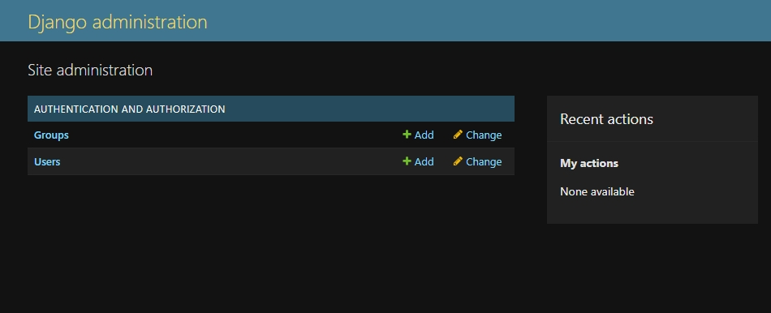

## Considerações finais
A atividade foi extremamente proveitosa para consolidar na prática os conceitos de isolamento de processos e gerenciamento de arquivos que estudamos em Sistemas Operacionais. 

Minha maior dificuldade inicial foi lidar com os conflitos de permissão entre os arquivos gerados dentro do contêiner (como root) e a edição no sistema hospedeiro, mas o ajuste rápido de permissões resolveu o problema. Também enfrentei o bloqueio de segurança "CSRF verification failed" ao tentar logar no painel Admin pelo Codespaces, o que exigiu que eu estudasse a documentação do Django e adicionasse as URLs do GitHub na lista de `CSRF_TRUSTED_ORIGINS` do `settings.py`. Como sugestão, destaco que o uso do GitHub Codespaces facilita enormemente a execução de práticas com Docker, evitando problemas de configuração na máquina local.